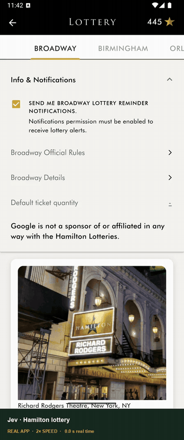

# Hamilton 樂透使用說明（Android app）

Hamilton 的 Broadway 樂透只能用官方 app 報名。這個範例讓 Jev 在 Android 模擬器上操作 Hamilton app：打開每一場的報名頁、選 2 張票、勾兩個確認框、送出。

<a href="hamilton-demo.mp4"></a>

<p><sub>真實的一次 run：8 場全部報名，實際 84.5 秒、47 次 Jev 決策、US$0.0042。影片 2 倍速，中間 6 場跳過，只保留第一場和最後一場；名字已模糊。重開 app 後 8 場都顯示 YOU’VE ENTERED!。<a href="hamilton-demo.mp4">看 MP4</a> · <a href="measurement.json">數據</a></sub></p>

## 準備

- Mac、git、[uv](https://docs.astral.sh/uv/getting-started/installation/)
- [Android Studio](https://developer.android.com/studio)：在 Device Manager 建一台**有 Google Play** 的模擬器
- 在模擬器裡登入 Google Play，安裝 **Hamilton — The Official App**（Hamilton Uptown LLC）
- 打開 app，**自己登入 Hamilton 帳號一次**。app 重開後仍會保持登入；程式不會輸入任何帳號密碼
- 一把 `TYPESAFE_API_KEY`（[TypeSafe](https://docs.typesafe.ai/introduction)，付費；8 場報名一次約 US$0.004）

## 安裝

```bash
git clone https://github.com/Holychung/jev-browser-lab.git
cd jev-browser-lab
uv sync --extra android
cp .env.example .env
```

打開 `.env`，把 key 貼在 `TYPESAFE_API_KEY=` 後面，其他不用動。`.env` 不要給別人。

## 先測試（不會送出）

模擬器開著、Hamilton app 已登入，執行：

```bash
uv run --env-file .env --extra android python examples/hamilton.py --all --dry-run
```

它會找出所有開放的場次，每一場都打開報名頁、保持 2 張、勾好兩個框，**停在 Submit Your Entry 前面**，然後退回清單。最後會重開 app，確認每一場都還沒報名。

## 正式報名

```bash
uv run --env-file .env --extra android python examples/hamilton.py --all
```

1. 每次送出前會暫停，顯示 `PAUSED before Submit Your Entry for ...`。確認沒問題，就在另一個終端機執行：

   ```bash
   touch artifacts/hamilton/latest/approve
   ```

   不要就改成 `reject`，那一場會跳過。確定全部都要報，執行時加 `--auto-approve`。
2. 送出後 app 會自己回到清單，那一場的卡片會變成 **YOU’VE ENTERED!**。
3. 最後 `VERIFIED after restart:` 是重開 app 後重讀的結果，每一場顯示 `"entered": true` 就是報名成功（有沒有中要等抽籤結果，app 會推播通知，也會寄 email）。

## 只想抽某幾場？

把 `--all` 換成 `--performance`，寫法要跟 app 卡片上的日期和時間一樣，可以重複放：

```bash
uv run --env-file .env --extra android python examples/hamilton.py --performance 'October 10, 2026 1:00pm' --performance 'October 11, 2026 1:00pm'
```

- 只要 1 張票：加 `--tickets 1`（預設 2 張）
- 寫錯或那一場沒開放，它會停下來並列出可以報的場次

## 錄影（選用）

```bash
uv run --env-file .env --extra android python examples/hamilton.py --all --record
uv run python scripts/render_hamilton.py artifacts/hamilton/latest --speed 2 --skip-middle --gif
```

錄的是模擬器自己的畫面。名字會自動模糊，點擊和拖曳會加上圈圈和軌跡，最後接一張成績畫面。`--skip-middle` 只保留第一場和最後一場。

## 注意

- 開放和截止時間以 app 卡片上寫的為準（2026-09-25 這一輪是美東週五 10:00 開放，10 月 1 日中午截止）
- 同一場只能報一次，重複報名會被取消；程式也不會對同一場送兩次
- 你的名字不會傳給模型，錄影時會被模糊
- app 登入過期時，程式會停下來，在模擬器手動登入後再跑一次

想用 Chrome 報名 Telecharge 樂透，請看 [Telecharge 使用說明](../telecharge/README.md)。

有任何問題或是想法歡迎聯繫我！

## 最簡單的方法

把這份文件丟給 Claude Code 或 Codex，請它照著幫你裝好、跑起來。

## 免責聲明

這是個人專案，僅供學習參考，與 Hamilton、Broadway Direct、TypeSafe、Browser Use 都沒有關係。Hamilton app 的 Official Rules（Broadway Direct）寫明：用自動化或程式化方式報名，報名可能被取消，也可能被禁止參加之後的抽籤。執行前請自己讀過規則、評估風險；帳號被取消資格等後果需自行負責。
