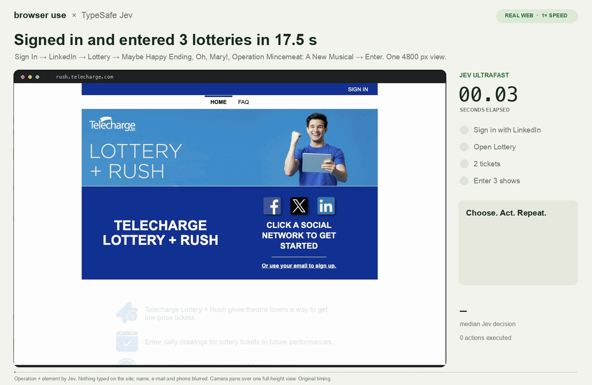

# Jev Ultrafast 使用說明

這個專案是一個瀏覽器 agent：給它一個網頁和一句目標，它會在你的 Chrome 裡自己點、自己打字，直到完成。

## 準備

- Google Chrome、git、[uv](https://docs.astral.sh/uv/getting-started/installation/)（會自動裝好 Python）
- 一把 `TYPESAFE_API_KEY`（[TypeSafe](https://docs.typesafe.ai/introduction)，付費；上次抽三部劇花了 US$0.00175，一整年每天抽不到 $1 USD）

## 安裝

```bash
git clone https://github.com/Holychung/jev-browser-lab.git
cd jev-browser-lab
uv sync
cp .env.example .env
```

打開 `.env`，把 key 貼在 `TYPESAFE_API_KEY=` 後面，其他不用動。`.env` 不要給別人。

## 抽 Telecharge 樂透

1. 先在 Chrome 裡手動登入 LinkedIn 一次（Telecharge 帳號用 LinkedIn 登入；其他登入方式也可以，但要小改 code）。Jev 不會輸入任何帳號密碼。
2. 執行：

   ```bash
   uv run --env-file .env python examples/telecharge.py --show 'Oh, Mary!'
   ```

   第一次 Chrome 會問是否允許 remote debugging，按 **Allow**。
3. 每次按 Enter 前會暫停，顯示 `PAUSED before clicking ...`。確認沒問題，就在另一個終端機執行：

   ```bash
   touch artifacts/telecharge/latest/approve
   ```

   不要就改成 `reject`。不想每次確認，執行時加 `--auto-approve`。
4. 最後 `VERIFIED after reload:` 那行是重新載入頁面後的結果，每個場次顯示 `'entered': True` 就是報名成功（有沒有中要等抽籤結果）。

## 想抽別的劇？

例如想抽 Maybe Happy Ending，把 `--show` 後面換成劇名就好：

```bash
uv run --env-file .env python examples/telecharge.py --show 'Maybe Happy Ending'
```

- 劇名要跟 Lottery 頁面上寫的一模一樣。打錯或當天沒有，它會停下來並列出可以抽的劇名。
- 一次抽好幾部：`--show` 重複放，例如 `--show 'Maybe Happy Ending' --show 'Oh, Mary!'`
- 只抽某個時段：加 `--when '7:00PM'`
- 只要 1 張票：加 `--tickets 1`（預設 2 張）

## 完成

<a href="telecharge-demo.mp4"></a>

<p align="center"><sub>真實的一次 run：從未登入到報名完三部劇共 17.5 秒，原速播放，每一筆都在重新載入頁面後確認過。<a href="telecharge-demo.mp4">看 MP4 原檔</a></sub></p>

有任何問題或是想法歡迎聯繫我！

## 最簡單的方法

把這份文件丟給 Claude Code 或 Codex，請它照著幫你裝好、跑起來。

## 免責聲明

這是個人專案，僅供學習參考，與 Telecharge、Lucky Seat、LinkedIn、TypeSafe、Browser Use 都沒有關係。抽票範例會用你自己的帳號操作真實網站，執行前請先確認網站的使用條款；帳號被停權等後果需自行負責。

